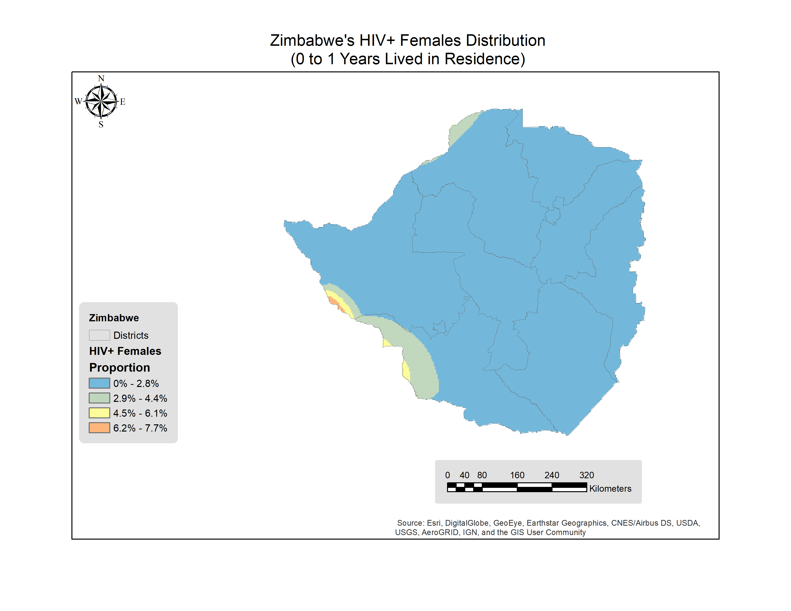
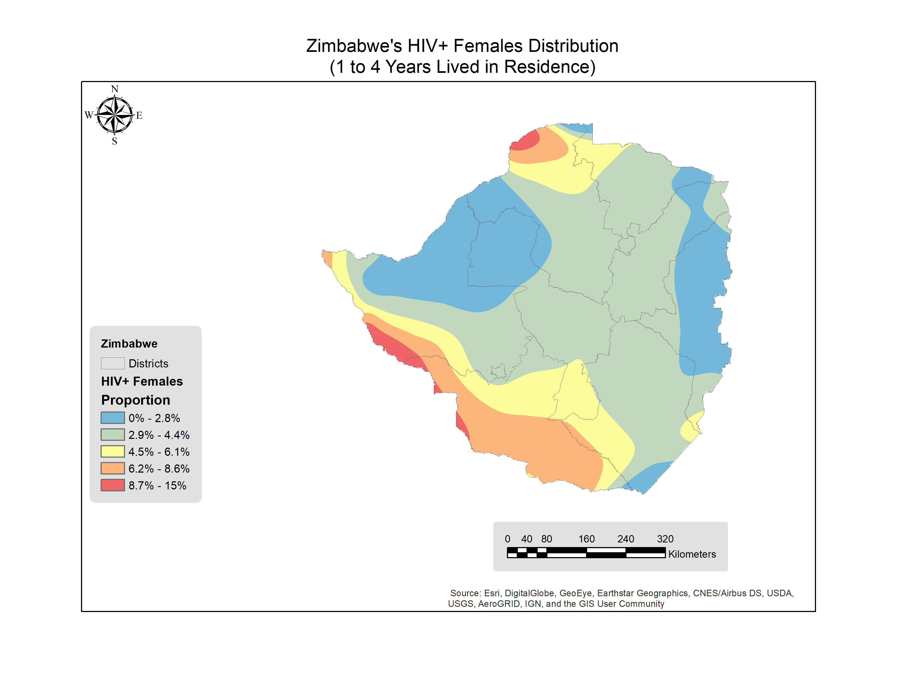
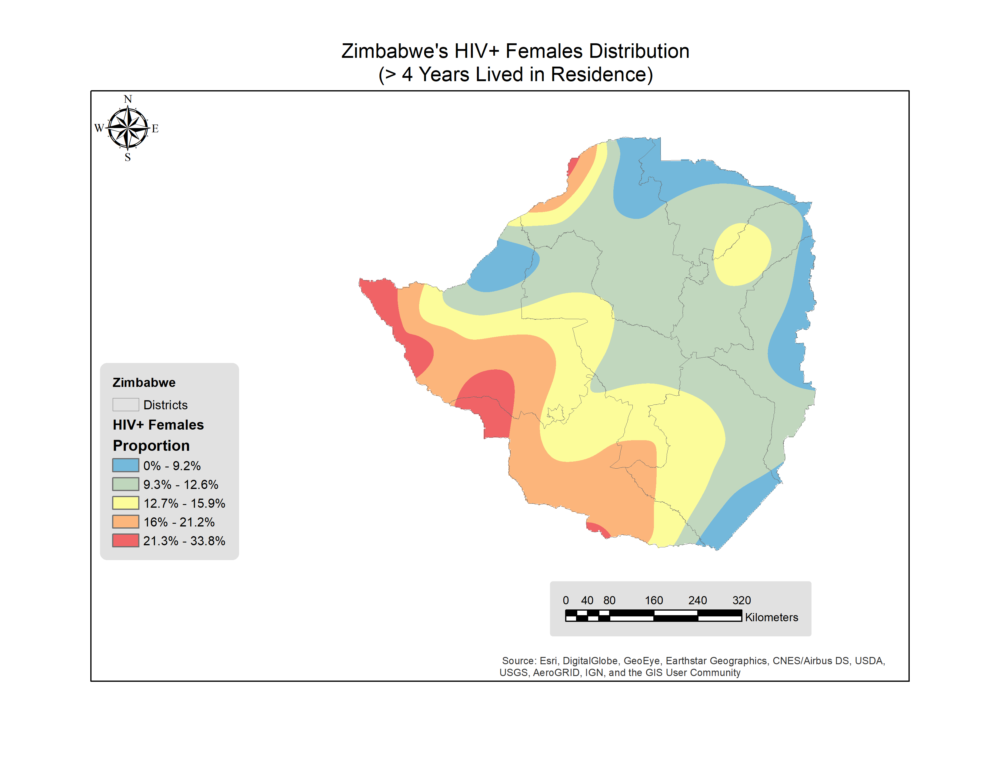
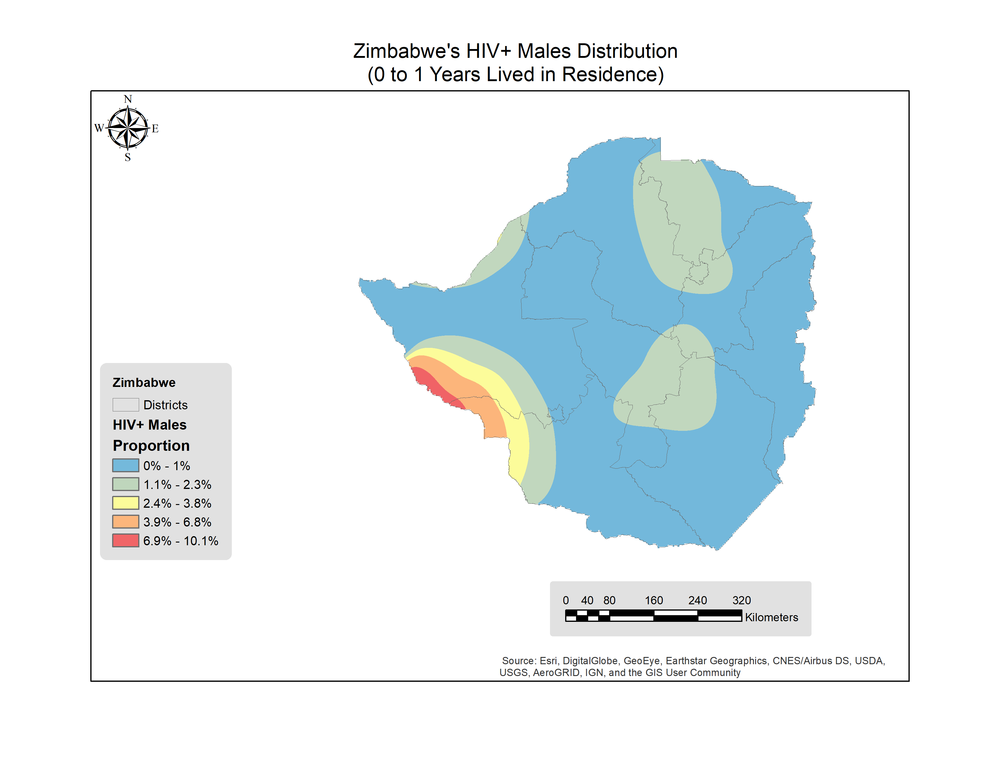
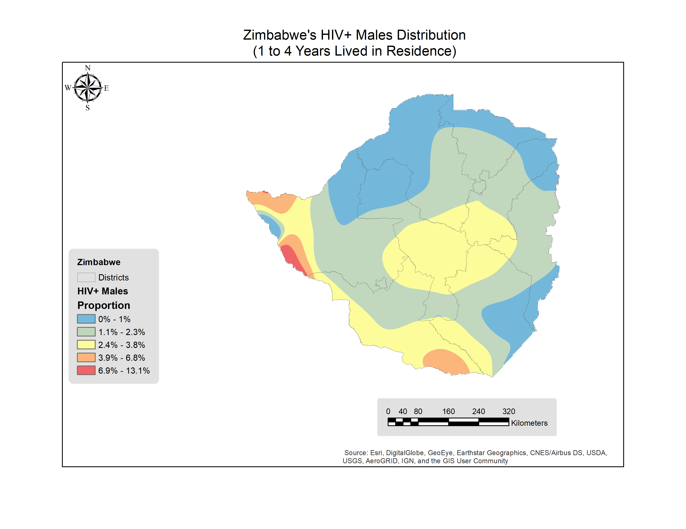
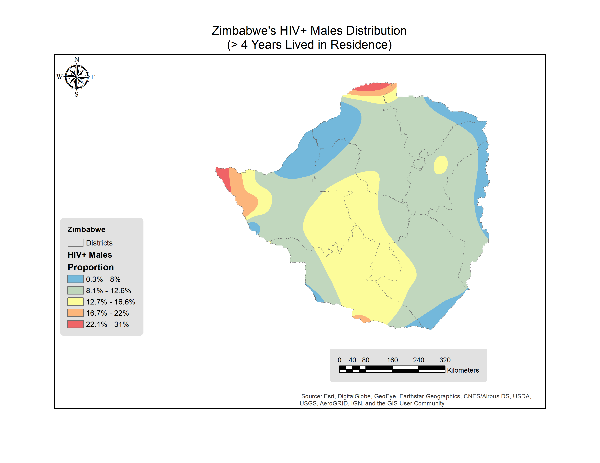

---
output:
  html_document: default
  pdf_document: default
---
# Zimbabwe {#week1}

## Females

```{r setup, include=FALSE, echo=FALSE, warning=FALSE,comment=FALSE}
knitr::opts_chunk$set(echo=FALSE, warning=FALSE,comment="")
rm(list = ls())
library(foreign)
library(plyr)
library(survey)
# library(finalfit)
library(jtools)
library(kableExtra)
library(broom)
library(ggstance)
# load female, male and hiv records of Zimbabwe
femaleDataFrame <- read.spss("../Zimbabwe/2015-2016/ZWIR71SV/ZWIR71FL.SAV")
hivDataFrame <- read.spss("../Zimbabwe/2015-2016/ZWAR71SV/ZWAR71FL.SAV")
```


```{r}
# Extract variables of interest
femaleDataset <- as.data.frame(femaleDataFrame$V001) #clnumber
femaleDataset$V002 <- femaleDataFrame$V002 # hhnumber
femaleDataset$V003 <- femaleDataFrame$V003 # linenumber
femaleDataset$V005 <- femaleDataFrame$V005 # indivweight
femaleDataset$V013 <- femaleDataFrame$V013 # age
femaleDataset$V104 <- femaleDataFrame$V104 # YLivedinResidence
femaleDataset$V190 <- femaleDataFrame$V190 # Wealthindexcombined
femaleDataset$V106 <- femaleDataFrame$V106 # higher level of education
femaleDataset$V130 <- femaleDataFrame$V130 # religion
femaleDataset$V481 <- femaleDataFrame$V481 # covered by health insurance
femaleDataset$V501 <- femaleDataFrame$V501 # marital status
femaleDataset$sex <- "f"

#sexual variables
femaleDataset$V781 <- femaleDataFrame$V781 # hivtested
femaleDataset$V763a <- femaleDataFrame$V763A # previous STI 12 
femaleDataset$V766b <- femaleDataFrame$V766B # number of sex partners
femaleDataset$V754dp <- femaleDataFrame$V754DP # risk one partner

femaleDataset$V754cp <- femaleDataFrame$V754CP # risk one partner
femaleDataset$V791a <- femaleDataFrame$V791A# Last 12 months had sex in return for gifts, 
#geographical variables
femaleDataset$region <- femaleDataFrame$V024 # region
femaleDataset$placeType <- femaleDataFrame$V025 # rural or urban
femaleDataset$V026 <- femaleDataFrame$V026 # placeLocation
femaleDataset$PSU <- femaleDataFrame$V021 # PSU svydesign
femaleDataset$V022 <- femaleDataFrame$V022 # Strata sampling error

# rename each column for nemonic purposes
names(femaleDataset) <- c(
  "clnumber",
  "hhnumber",
  "linenumber",
  "indivweight",
  "agegroup",
  "YLivedinResidence",
  "Wealthindexcombined",
  "education",
  "religion",
  "healthInsured",
  "maritalStatus",
  "sex",
  
  "hivtested",
  "previousSTI",
  "sexPartners",
  "have1sexpartner",
  
  "alwaysCondom",
  "paidforsex",
  
  "region",
  "placeType",
  "placeLocation",
  "PSU",
  "V022"
)

# id for females
femaleDataset$id<-paste(femaleDataset$clnumber,
                        femaleDataset$hhnumber,
                        femaleDataset$linenumber,sep="")
femaleDataset$id<-as.numeric(femaleDataset$id, 16L)
```


```{r}

# Extract variables from HIV
hivdataset <- as.data.frame(hivDataFrame$HIVCLUST) #clnumber
hivdataset$HIVNUMB <- hivDataFrame$HIVNUMB # hhnumber
hivdataset$HIVLINE <- hivDataFrame$HIVLINE # linenumber
hivdataset$HIV03 <- hivDataFrame$HIV03 # hivStatus
hivdataset$HIV05 <- hivDataFrame$HIV05 # sample weight
names(hivdataset) <- c(
  "clnumber",
  "hhnumber",
  "linenumber",
  "hivStatus",
  "sampleweight"
)
# key for join creation
hivdataset$id<-paste(hivdataset$clnumber,
                     hivdataset$hhnumber,
                     hivdataset$linenumber,sep="")
hivdataset$id<-as.numeric(hivdataset$id, 16L)

```


```{r}

### merge female and hiv
merged.data <- merge(femaleDataset, hivdataset, by = "id")
 # table(merged.data$YLivedinResidence)
merged.data<- merged.data[merged.data$YLivedinResidence != "Visitor", ]  # se remueven visitantes

merged.data$migstatus<-"gt4"
merged.data$migstatus[merged.data$YLivedinResidence == 0] <-"0_1y"
merged.data$migstatus[merged.data$YLivedinResidence == 1 | 
                        merged.data$YLivedinResidence ==2|
                         merged.data$YLivedinResidence == 3 | 
                        merged.data$YLivedinResidence ==4] <-"1_4y"
merged.data$migstatus[merged.data$YLivedinResidence > 4]<-"gt4"

 # table(merged.data$migstatus)
#factorize variables
merged.data$migstatus<-as.factor(merged.data$migstatus)
merged.data$hivStatus<-as.factor(merged.data$hivStatus)

# levels(merged.data$hivStatus)
# table(merged.data$hivStatus)
#remove 9 results in hivStatus
merged.data <-merged.data[merged.data$hivStatus == "HIV  positive" | merged.data$hivStatus == "HIV negative", ]
# normalize weight
merged.data$indivweight<-merged.data$indivweight/1000000
#check NAs
merged.data<-merged.data[!is.na(merged.data$indivweight),]

# which(is.na(merged.data$migstatus))
# sum(is.na(merged.data$migstatus))
# apply(merged.data, 2, function(x) any(is.na(x)))
# table(merged.data$hivStatus)
# levels(merged.data$hivStatus)
merged.data$hivStatus<-as.factor(revalue(as.character(merged.data$hivStatus), c("HIV  positive" = "hiv+","HIV negative"="hiv-")))


## remove of dont know
# table(merged.data$migstatus,merged.data$have1sexpartner)
merged.data <-merged.data[which(merged.data$have1sexpartner =="No" |
                                  merged.data$have1sexpartner =="Yes"),]
merged.data$have1sexpartner<-as.factor(revalue(as.character(merged.data$have1sexpartner),
                                               c("No" = "No","Yes"="Yes")))

## se comenta porque no se usa en la logit
# table(merged.data$migstatus,merged.data$sexPartners)
# merged.data <-merged.data[merged.data$sexPartners != "99", ]
# merged.data <-merged.data[merged.data$sexPartners != "Don't know", ]
# merged.data$poligamy<-"Yes"
# merged.data$poligamy[merged.data$sexPartners == "0" | merged.data$sexPartners == "1"]<-"No"
# merged.data$poligamy<-as.factor(merged.data$poligamy)
# table(merged.data$migstatus,merged.data$poligamy)

# 
 # table(merged.data$migstatus,merged.data$paidforsex)
# 
# table(merged.data$migstatus,merged.data$alwaysCondom)
merged.data <-merged.data[merged.data$alwaysCondom == "No" | merged.data$alwaysCondom == "Yes", ]
merged.data$alwaysCondom<-as.factor(revalue(as.character(merged.data$alwaysCondom), c("No" = "No","Yes"="Yes")))
# 
# previousSTI
# table(merged.data$migstatus,merged.data$previousSTI)
merged.data <-merged.data[merged.data$previousSTI == "No" | merged.data$previousSTI == "Yes", ]
merged.data$previousSTI<-as.factor(revalue(as.character(merged.data$previousSTI), c("No" = "No","Yes"="Yes")))
# education
# table(merged.data$migstatus,merged.data$education)

# marital status
# table(merged.data$migstatus,merged.data$maritalStatus)

# marital status
# table(merged.data$migstatus,merged.data$healthInsured)

# marital status
# table(merged.data$migstatus,merged.data$religion)
merged.data$religion<-as.factor(revalue(as.character(merged.data$religion), c("Roman Catholic" = "Christian",
                                                                              "Protestant"="Christian",
                                                                              "Pentecostal"="Christian",
                                                                              "Apostolic sect"="Christian",
                                                                              "Other Christian"="Christian",
                                                                              "None"="None/Other",
                                                                              "Other"="None/Other"
                                                                              )))
# table(merged.data$migstatus,merged.data$religion)


```


```{r}
merged.data$migstatus<-relevel(merged.data$migstatus, ref = "gt4")

# merged.data$placeType<-relevel(merged.data$placeType, ref = "Rural")
merged.data$hivStatus<-relevel(merged.data$hivStatus, ref = "hiv-")
# merged.data$agegroup<-relevel(merged.data$agegroup, ref = "15-19")
# merged.data$Wealthindexcombined<-relevel(merged.data$Wealthindexcombined, ref = "Poorest")


options (survey.lonely.psu = "remove")
dhs1<- svydesign(id = ~PSU, 
                 strata = ~V022,
                 weights = ~indivweight,
                 nest=TRUE,
                 data = merged.data)

# summary(dhs1)
```

```{r, eval=FALSE}
#multicolinealidad
svychisq(~migstatus+hivStatus, design = dhs1,statistic="F")
svychisq(~migstatus+hivStatus, design = dhs1,statistic="Chisq")
svychisq(~migstatus+hivStatus, design = dhs1,statistic="Wald")
svychisq(~migstatus+hivStatus, design = dhs1,statistic="adjWald")


Xsq<-svychisq(~migstatus+hivStatus, design = dhs1,statistic="adjWald")
Xsq
tab<-svytable(~migstatus+hivStatus, design = dhs1)
round(tab,digits = 1)
prop.table(tab,margin = 1) 
library(fifer)
library(ggplot2)
t<-chisq.post.hoc(tab, test='chisq.test',popsInRows = TRUE,
  control = c("bonferroni"),
  digits = 3)
t
ggplot(data = merged.data, 
       aes(x = hivStatus, fill = migstatus)) + 
  geom_bar(position = "fill") +
  theme_bw() +
  labs(x= "HIV Status", y = "Fraction") +
  guides(fill = guide_legend(reverse = TRUE))
# tab<-table(merged.data$hivStatus,merged.data$migstatus)
# tab
# barplot(tab,beside = T,legend=T)
# chisq.test(tab)
# fisher.test(tab,
#             conf.int = T,
#             conf.level = 0.95)
# 
# # aqui descarto poligamia porque ambas son colineales
# svychisq(~have1sexpartner+poligamy, design = dhs1, statistic="Wald")

```

<!-- Based on the proportion test, we can argue there is not significative evidence that proportions in _HIV+ females_ varies between _migrant_ and _non migrant_. -->

### HIV Analysis

```{r,fig.cap="Visual representation of CI for hiv model."}
fit<-svyglm(hivStatus~agegroup+
              education+
              healthInsured+
              maritalStatus+
              Wealthindexcombined+
              religion+
              migstatus+
              placeType+
              have1sexpartner+
              alwaysCondom+
              previousSTI+
              hivtested,
            data=merged.data,
            family=quasibinomial(),
            design=dhs1)
# summary(fit)  ##right
# exp(confint(fit))
# fit$aic
# fit$deviance
# fit$R

 summ(fit, exp = T,confint = TRUE,digits = 3)

fitb<-svyglm(hivStatus~agegroup+
              education+
              healthInsured+
              maritalStatus+
              Wealthindexcombined+
              religion+
              placeType+
              have1sexpartner+
              alwaysCondom+
              previousSTI+
              hivtested,
            data=merged.data,
            family=quasibinomial(),
            design=dhs1)

fitc<-svyglm(hivStatus~migstatus,
            data=merged.data,
            family=quasibinomial(),
            design=dhs1)

# anova(fit, fitb,fitc, test = "Chisq",method="LRT")
# AIC(fit,fitb,fitc)
# BIC(fit,fitb,fitc,maximal=fit)

# summary(fit)  ##right
# exp(confint(fit))
# fit$aic
# fit$deviance
# fit$R
```

```{r,eval=FALSE}
suppressMessages(library(ggplot2))
suppressMessages(library(ROCR))
prob <- predict(fit, type = "response")
pred <- prediction(as.vector(prob),dhs1$variables$hivStatus)
perf <- performance(pred, "tpr", "fpr")
# I know, the following code is bizarre. Just go with it.
auc <- performance(pred, measure = "auc")
auc <- auc@y.values[[1]]
roc.data <- data.frame(fpr = unlist(perf@x.values), tpr = unlist(perf@y.values), 
    model = "GLM")

prob2 <- predict(fitb, type = "response")
pred2 <- prediction(as.vector(prob2),dhs1$variables$hivStatus)
perf2 <- performance(pred2, "tpr", "fpr")
# I know, the following code is bizarre. Just go with it.
auc2 <- performance(pred2, measure = "auc")
auc2 <- auc2@y.values[[1]]
roc.data2 <- data.frame(fpr = unlist(perf2@x.values), tpr = unlist(perf2@y.values), 
    model = "GLM")

prob3 <- predict(fitc, type = "response")
pred3 <- prediction(as.vector(prob3),dhs1$variables$hivStatus)
perf3 <- performance(pred3, "tpr", "fpr")
# I know, the following code is bizarre. Just go with it.
auc3<- performance(pred3, measure = "auc")
auc3 <- auc3@y.values[[1]]
roc.data3 <- data.frame(fpr = unlist(perf3@x.values), tpr = unlist(perf3@y.values), 
    model = "GLM")

ggplot(roc.data, aes(x = fpr, ymin = 0, ymax = tpr)) + 
  geom_ribbon(alpha = 0.2) + 
    geom_abline(intercept = 0, slope = 1, colour = "gray") +
    geom_line(aes(y = tpr) )+ 
    geom_line(data = roc.data2,aes(y = tpr), col="red") + 
    geom_line(data = roc.data3,aes(y = tpr), col="blue") + 
    ggtitle(paste0("ROC Curve w/ AUC1=", round(auc,2),", AUC2=",round(auc2,2),", AUC3=",round(auc3,2)))

```

### Migration Analysis

#### Migration 0-1 ~ cofactors for females

```{r}
# table(merged.data$migstatus)
only0_1y<-merged.data

only0_1y$migstatus<-as.factor(revalue(as.character(only0_1y$migstatus), 
                                      c("gt4" = "gt1","1_4y"="gt1")))
# table(only0_1y$migstatus)
only0_1y$migstatus<-relevel(only0_1y$migstatus,ref="gt1")

dhs2<- svydesign(id = ~PSU, 
                 strata = ~V022,
                 weights = ~indivweight,
                 nest=TRUE,
                 data = only0_1y)

fit2<-svyglm(migstatus~agegroup+
              education+
              healthInsured+
              maritalStatus+
              Wealthindexcombined+
              religion+
              placeType+
              have1sexpartner+
              alwaysCondom+
              previousSTI+
              hivtested,
            data=only0_1y,
            family=quasibinomial(),
            design=dhs2)
# summary(fit2)
summ(fit2, exp = T,confint = TRUE,digits = 3)

```

#### Migration 1-5 ~ cofactors for females

```{r}
# table(merged.data$migstatus)
only1_4y<-merged.data

only1_4y$migstatus<-as.factor(revalue(as.character(only1_4y$migstatus), 
                                      c("gt4" = "others","0_1y"="others")))
# table(only1_4y$migstatus)
only1_4y$migstatus<-relevel(only1_4y$migstatus,ref="others")

dhs3<- svydesign(id = ~PSU, 
                 strata = ~V022,
                 weights = ~indivweight,
                 nest=TRUE,
                 data = only1_4y)

fit3<-svyglm(migstatus~agegroup+
              education+
              healthInsured+
              maritalStatus+
              Wealthindexcombined+
              religion+
              placeType+
              have1sexpartner+
              alwaysCondom+
              previousSTI+
              hivtested,
            data=only0_1y,
            family=quasibinomial(),
            design=dhs3)
# summary(fit3)
summ(fit3, exp = T,confint = TRUE,digits = 3)
```

### Mapping

```{r, eval=FALSE}
# 0_1y
merged.data$m0_1y.hiv<-0
merged.data$m0_1y.hiv[merged.data$migstatus=="0_1y" & merged.data$hivStatus=="hiv+"]<-1*merged.data$indivweight[merged.data$migstatus=="0_1y" & merged.data$hivStatus=="hiv+"]

merged.data$m0_1y.nonhiv<-0
merged.data$m0_1y.nonhiv[merged.data$migstatus=="0_1y" & merged.data$hivStatus=="hiv-"]<-1*merged.data$indivweight[merged.data$migstatus=="0_1y" & merged.data$hivStatus=="hiv-"]

# 1_4y
merged.data$m1_4y.hiv<-0
merged.data$m1_4y.hiv[merged.data$migstatus=="1_4y" & merged.data$hivStatus=="hiv+"]<-1*merged.data$indivweight[merged.data$migstatus=="1_4y" & merged.data$hivStatus=="hiv+"]

merged.data$m1_4y.nonhiv<-0
merged.data$m1_4y.nonhiv[merged.data$migstatus=="1_4y" & merged.data$hivStatus=="hiv-"]<-1*merged.data$indivweight[merged.data$migstatus=="1_4y" & merged.data$hivStatus=="hiv-"]

# gt4
merged.data$gt4.hiv<-0
merged.data$gt4.hiv[merged.data$migstatus=="gt4" & merged.data$hivStatus=="hiv+"]<-1*merged.data$indivweight[merged.data$migstatus=="gt4" & merged.data$hivStatus=="hiv+"]

merged.data$gt4.nonhiv<-0
merged.data$gt4.nonhiv[merged.data$migstatus=="gt4" & merged.data$hivStatus=="hiv-"]<-1*merged.data$indivweight[merged.data$migstatus=="gt4" & merged.data$hivStatus=="hiv-"]


# agregacion por cluster
fileexport <- as.data.frame.matrix(
  aggregate(cbind(
    merged.data$m0_1y.hiv,
    merged.data$m0_1y.nonhiv,
    merged.data$m1_4y.hiv,
    merged.data$m1_4y.nonhiv,
    merged.data$gt4.hiv,
    merged.data$gt4.nonhiv,
    merged.data$indivweight) ~ merged.data$PSU,
    FUN = sum, data = merged.data))
names(fileexport) <- c(
  "clnumber",
  "m0_1y.hiv",
  "m0_1y.nonhiv",
  "m1_4y.hiv",
  "m1_4y.nonhiv",
  "gt4.hiv",
  "gt4.nonhiv",
  "total.pop"
)

# 0_1y
fileexport$m0_1y.hiv.rate<-fileexport$m0_1y.hiv/fileexport$total.pop # hiv migrants distribution
fileexport$allm0_1y.rate<-(fileexport$m0_1y.hiv+fileexport$m0_1y.nonhiv)/fileexport$total.pop #all migrants distribution

# 1_4y
fileexport$m1_4y.hiv.rate<-fileexport$m1_4y.hiv/fileexport$total.pop 
fileexport$allm1_4y.rate<-(fileexport$m1_4y.hiv+fileexport$m1_4y.nonhiv)/fileexport$total.pop 

# gt4
fileexport$gt4.hiv.rate<-(fileexport$gt4.hiv)/fileexport$total.pop

# all
fileexport$allhiv.rate<-(fileexport$m0_1y.hiv+fileexport$m1_4y.hiv+fileexport$gt4.hiv)/fileexport$total.pop #hiv distribution

write.csv(fileexport, "females.spatial.csv")


```

```{r fm0_1yzwe, echo=FALSE, fig.cap="0 to 1 Years distribution", out.width = '100%'}

```

```{r fm1_4yzwe, echo=FALSE, fig.cap="1 to 4 Years distribution", out.width = '100%'}

```

```{r fgt4zwe, echo=FALSE, fig.cap="Greater than 4 Years distribution", out.width = '100%'}

```
## Males

```{r}
rm(list = ls())

# load female, male and hiv records of Zimbabwe
maleDataFrame <- read.spss("../Zimbabwe/2015-2016/ZWMR71SV/ZWMR71FL.SAV")
hivDataFrame <- read.spss("../Zimbabwe/2015-2016/ZWAR71SV/ZWAR71FL.SAV")
```


```{r}
# Extract variables of interest
maleDataset <- as.data.frame(maleDataFrame$MV001) #clnumber
maleDataset$MV002 <- maleDataFrame$MV002 # hhnumber
maleDataset$MV003 <- maleDataFrame$MV003 # linenumber
maleDataset$MV005 <- maleDataFrame$MV005 # indivweight
maleDataset$MV013 <- maleDataFrame$MV013 # age
maleDataset$MV104 <- maleDataFrame$MV104 # YLivedinResidence
maleDataset$MV190 <- maleDataFrame$MV190 # Wealthindexcombined
maleDataset$MV106 <- maleDataFrame$MV106 # higher level of education
maleDataset$MV130 <- maleDataFrame$MV130 # religion
maleDataset$MV481 <- maleDataFrame$MV481 # covered by health insurance
maleDataset$MV501 <- maleDataFrame$MV501 # marital status
maleDataset$sex <- "m"

#sexual variables
maleDataset$MV781 <- maleDataFrame$MV781 # hivtested
maleDataset$MV763a <- maleDataFrame$MV763A # previous STI 12 
maleDataset$MV766b <- maleDataFrame$MV766B # number of sex partners
maleDataset$MV754dp <- maleDataFrame$MV754DP # risk one partner

maleDataset$MV754cp <- maleDataFrame$MV754CP # risk one partner
maleDataset$MV791 <- maleDataFrame$MV791# Last 12 months had sex in return for gifts, 
#geographical variables
maleDataset$region <- maleDataFrame$MV024 # region
maleDataset$placeType <- maleDataFrame$MV025 # rural or urban
maleDataset$MV026 <- maleDataFrame$MV026 # placeLocation
maleDataset$PSU <- maleDataFrame$MV021 # PSU svydesign
maleDataset$MV022 <- maleDataFrame$MV022 # Strata sampling error

# rename each column for nemonic purposes
names(maleDataset) <- c(
  "clnumber",
  "hhnumber",
  "linenumber",
  "indivweight",
  "agegroup",
  "YLivedinResidence",
  "Wealthindexcombined",
  "education",
  "religion",
  "healthInsured",
  "maritalStatus",
  "sex",
  
  "hivtested",
  "previousSTI",
  "sexPartners",
  "have1sexpartner",
  
  "alwaysCondom",
  "paidforsex",
  
  "region",
  "placeType",
  "placeLocation",
  "PSU",
  "V022"
)

# id for females
maleDataset$id<-paste(maleDataset$clnumber,
                        maleDataset$hhnumber,
                        maleDataset$linenumber,sep="")
maleDataset$id<-as.numeric(maleDataset$id, 16L)
```

```{r}
# Extract variables from HIV
hivdataset <- as.data.frame(hivDataFrame$HIVCLUST) #clnumber
hivdataset$HIVNUMB <- hivDataFrame$HIVNUMB # hhnumber
hivdataset$HIVLINE <- hivDataFrame$HIVLINE # linenumber
hivdataset$HIV03 <- hivDataFrame$HIV03 # hivStatus
hivdataset$HIV05 <- hivDataFrame$HIV05 # sample weight
names(hivdataset) <- c(
  "clnumber",
  "hhnumber",
  "linenumber",
  "hivStatus",
  "sampleweight"
)
# key for join creation
hivdataset$id<-paste(hivdataset$clnumber,
                     hivdataset$hhnumber,
                     hivdataset$linenumber,sep="")
hivdataset$id<-as.numeric(hivdataset$id, 16L)
```


```{r}

### merge female and hiv
merged.data <- merge(maleDataset, hivdataset, by = "id")
 # table(merged.data$YLivedinResidence)
merged.data<- merged.data[merged.data$YLivedinResidence != "Visitor", ]  # se remueven visitantes

# merged.data$migstatus[merged.data$YLivedinResidence == 0] <-"0_1y"
# merged.data$migstatus[merged.data$YLivedinResidence != 0 ]<-"gt1"
merged.data$migstatus<-"gt4"
merged.data$migstatus[merged.data$YLivedinResidence == 0] <-"0_1y"
merged.data$migstatus[merged.data$YLivedinResidence == 1 | 
                        merged.data$YLivedinResidence ==2|
                         merged.data$YLivedinResidence == 3 | 
                        merged.data$YLivedinResidence ==4] <-"1_4y"
merged.data$migstatus[merged.data$YLivedinResidence > 4]<-"gt4"

 # table(merged.data$migstatus)
#factorize variables
merged.data$migstatus<-as.factor(merged.data$migstatus)
merged.data$hivStatus<-as.factor(merged.data$hivStatus)

 # levels(merged.data$hivStatus)
 # table(merged.data$hivStatus)
#remove 9 results in hivStatus
merged.data <-merged.data[merged.data$hivStatus == "HIV  positive" | merged.data$hivStatus == "HIV negative", ]
# normalize weight
merged.data$indivweight<-merged.data$indivweight/1000000
#check NAs
merged.data<-merged.data[!is.na(merged.data$indivweight),]

# which(is.na(merged.data$migstatus))
# sum(is.na(merged.data$migstatus))
 # apply(merged.data, 2, function(x) any(is.na(x)))
merged.data<-merged.data[!is.na(merged.data$alwaysCondom),]
merged.data<-merged.data[!is.na(merged.data$paidforsex),]

 
 # table(merged.data$hivStatus)
# levels(merged.data$hivStatus)
merged.data$hivStatus<-as.factor(revalue(as.character(merged.data$hivStatus), c("HIV  positive" = "hiv+","HIV negative"="hiv-")))


## remove of dont know
 # table(merged.data$migstatus,merged.data$have1sexpartner)
merged.data <-merged.data[which(merged.data$have1sexpartner =="No" |
                                  merged.data$have1sexpartner =="Yes"),]
merged.data$have1sexpartner<-as.factor(revalue(as.character(merged.data$have1sexpartner),
                                               c("No" = "No","Yes"="Yes")))

 # table(merged.data$migstatus,merged.data$sexPartners)
merged.data <-merged.data[merged.data$sexPartners != "99", ]
merged.data <-merged.data[merged.data$sexPartners != "Don't know", ]
merged.data$poligamy<-"Yes"
merged.data$poligamy[merged.data$sexPartners == "0" | merged.data$sexPartners == "1"]<-"No"
merged.data$poligamy<-as.factor(merged.data$poligamy)
 # table(merged.data$migstatus,merged.data$poligamy)

# 
# table(merged.data$migstatus,merged.data$paidforsex)
# 
# table(merged.data$migstatus,merged.data$alwaysCondom)
merged.data <-merged.data[merged.data$alwaysCondom == "No" | merged.data$alwaysCondom == "Yes", ]
merged.data$alwaysCondom<-as.factor(revalue(as.character(merged.data$alwaysCondom), c("No" = "No","Yes"="Yes")))
# 
# previousSTI
# table(merged.data$migstatus,merged.data$previousSTI)
merged.data <-merged.data[merged.data$previousSTI == "No" | merged.data$previousSTI == "Yes", ]
merged.data$previousSTI<-as.factor(revalue(as.character(merged.data$previousSTI), c("No" = "No","Yes"="Yes")))
# education
 # table(merged.data$migstatus,merged.data$education)

# marital status
 # table(merged.data$migstatus,merged.data$maritalStatus)

# marital status
 # table(merged.data$migstatus,merged.data$healthInsured)

# marital status
 # table(merged.data$migstatus,merged.data$religion)
merged.data$religion<-as.factor(revalue(as.character(merged.data$religion), c("Roman Catholic" = "Christian",
                                                                              "Protestant"="Christian",
                                                                              "Pentecostal"="Christian",
                                                                              "Apostolic sect"="Christian",
                                                                              "Other Christian"="Christian",
                                                                              "None"="None/Other",
                                                                              "Other"="None/Other"
                                                                              )))
# table(merged.data$migstatus,merged.data$religion)


```


```{r}
merged.data$migstatus<-relevel(merged.data$migstatus, ref = "gt4")

# merged.data$placeType<-relevel(merged.data$placeType, ref = "Rural")
merged.data$hivStatus<-relevel(merged.data$hivStatus, ref = "hiv-")
# merged.data$agegroup<-relevel(merged.data$agegroup, ref = "15-19")
# merged.data$Wealthindexcombined<-relevel(merged.data$Wealthindexcombined, ref = "Poorest")


options (survey.lonely.psu = "remove")
dhs1<- svydesign(id = ~PSU, 
                 strata = ~V022,
                 weights = ~indivweight,
                 nest=TRUE,
                 data = merged.data)

# summary(dhs1)
```


<!-- ## Part 1: Association -->

```{r, eval=FALSE}

#multicolinealidad
svychisq(~migstatus+hivStatus, design = dhs1,statistic="F")
svychisq(~migstatus+hivStatus, design = dhs1,statistic="Chisq")
svychisq(~migstatus+hivStatus, design = dhs1,statistic="Wald")
svychisq(~migstatus+hivStatus, design = dhs1,statistic="adjWald")

Xsq<-svychisq(~migstatus+hivStatus, design = dhs1,statistic="adjWald")
Xsq
tab<-svytable(~migstatus+hivStatus, design = dhs1)
# tab<-table(merged.data$hivStatus,merged.data$migstatus)
 round(tab,digits = 1)
prop.table(tab,margin = 1) 
library(fifer)
library(ggplot2)
t<-chisq.post.hoc(tab, test='chisq.test',popsInRows = TRUE,
  control = c("bonferroni"),
  digits = 3)
t
ggplot(data = merged.data, 
       aes(x = hivStatus, fill = migstatus)) + 
  geom_bar(position = "fill") +
  theme_bw() +
  labs(x= "HIV Status", y = "Fraction") +
  guides(fill = guide_legend(reverse = TRUE))


fit<-svyglm(hivStatus~migstatus,family=quasibinomial(),
            design=dhs1)

summ(fit, exp = T,confint = TRUE,digits = 3)


# chisq.test(tab)
# fisher.test(tab,
#             conf.int = T,
#             conf.level = 0.95)

# aqui descarto poligamia porque ambas son colineales
# svychisq(~have1sexpartner+poligamy, design = dhs1, statistic="Wald")

```

<!-- Based on the proportion test, we can argue there is significative evidence that proportions in _HIV+ males_ varies between _migrants of 1_4 years_ and _non migrant (greater than 4 years of settlement_. -->

<!-- Post hoc comparisons of rates of hiv by years lived in home categories revealed that higher rates of HIV are seen in people that lived more than 4 years compared to lower rates in 1 to 4 years group. In comparison, prevalence of HIV was statistically similar among 0 to 1 year group (migrants) and people that lived more than 4 years. -->

### HIV Analysis

```{r}
# table(merged.data$religion) # no se incluye porque solo 534 tienen respuesta
fit<-svyglm(hivStatus~agegroup+
              education+
              healthInsured+
              maritalStatus+
              Wealthindexcombined+
              religion+
              migstatus+
              placeType+
              have1sexpartner+
              alwaysCondom+
              previousSTI+
              hivtested,
            data=merged.data,
            family=quasibinomial(),
            design=dhs1)
# summary(fit)  ##right

# exp(confint(fit))
# fit$aic
# fit$deviance
# fit$R

# fitb<-svyglm(hivStatus~agegroup+
            #   education+
            #   healthInsured+
            #   maritalStatus+
            #   Wealthindexcombined+
            #   religion+
            #   placeType+
            #   have1sexpartner+
            #   alwaysCondom+
            #   previousSTI+
            #   hivtested,
            # data=merged.data,
            # family=quasibinomial(),
            # design=dhs1)

# anova(fit, fitb, test = "Chisq",method="LRT")
# AIC(fit,fitb)
# BIC(fit,fitb,maximal=fit)

summ(fit, exp = T,confint = TRUE,digits = 3)


# plot_summs(fit, scale = TRUE, robust = "HC3", plot.distributions = TRUE,exp = TRUE)


```

### Migration Analysis

#### Migration 0-1 ~ cofactors for males

```{r}
# table(merged.data$migstatus)
only0_1y<-merged.data

only0_1y$migstatus<-as.factor(revalue(as.character(only0_1y$migstatus), 
                                      c("gt4" = "gt1","1_4y"="gt1")))
# table(only0_1y$migstatus)
only0_1y$migstatus<-relevel(only0_1y$migstatus,ref="gt1")

dhs2<- svydesign(id = ~PSU, 
                 strata = ~V022,
                 weights = ~indivweight,
                 nest=TRUE,
                 data = only0_1y)

fit2<-svyglm(migstatus~agegroup+
              education+
              healthInsured+
              maritalStatus+
              Wealthindexcombined+
              religion+
              placeType+
              have1sexpartner+
              alwaysCondom+
              previousSTI+
              hivtested,
            data=only0_1y,
            family=quasibinomial(),
            design=dhs2)
# summary(fit2)
summ(fit2, exp = T,confint = TRUE,digits = 3)

```

#### Migration 1-5 ~ cofactors for males

```{r}
# table(merged.data$migstatus)
only1_4y<-merged.data

only1_4y$migstatus<-as.factor(revalue(as.character(only1_4y$migstatus), 
                                      c("gt4" = "others","0_1y"="others")))
# table(only1_4y$migstatus)
only1_4y$migstatus<-relevel(only1_4y$migstatus,ref="others")

dhs3<- svydesign(id = ~PSU, 
                 strata = ~V022,
                 weights = ~indivweight,
                 nest=TRUE,
                 data = only1_4y)

fit3<-svyglm(migstatus~agegroup+
              education+
              healthInsured+
              maritalStatus+
              Wealthindexcombined+
              religion+
              placeType+
              have1sexpartner+
              alwaysCondom+
              previousSTI+
              hivtested,
            data=only0_1y,
            family=quasibinomial(),
            design=dhs3)
# summary(fit3)
summ(fit3, exp = T,confint = TRUE,digits = 3)
```

### Mapping

```{r, eval=FALSE}
# 0_1y
merged.data$m0_1y.hiv<-0
merged.data$m0_1y.hiv[merged.data$migstatus=="0_1y" & merged.data$hivStatus=="hiv+"]<-1*merged.data$indivweight[merged.data$migstatus=="0_1y" & merged.data$hivStatus=="hiv+"]

merged.data$m0_1y.nonhiv<-0
merged.data$m0_1y.nonhiv[merged.data$migstatus=="0_1y" & merged.data$hivStatus=="hiv-"]<-1*merged.data$indivweight[merged.data$migstatus=="0_1y" & merged.data$hivStatus=="hiv-"]

# 1_4y
merged.data$m1_4y.hiv<-0
merged.data$m1_4y.hiv[merged.data$migstatus=="1_4y" & merged.data$hivStatus=="hiv+"]<-1*merged.data$indivweight[merged.data$migstatus=="1_4y" & merged.data$hivStatus=="hiv+"]

merged.data$m1_4y.nonhiv<-0
merged.data$m1_4y.nonhiv[merged.data$migstatus=="1_4y" & merged.data$hivStatus=="hiv-"]<-1*merged.data$indivweight[merged.data$migstatus=="1_4y" & merged.data$hivStatus=="hiv-"]

# gt4
merged.data$gt4.hiv<-0
merged.data$gt4.hiv[merged.data$migstatus=="gt4" & merged.data$hivStatus=="hiv+"]<-1*merged.data$indivweight[merged.data$migstatus=="gt4" & merged.data$hivStatus=="hiv+"]

merged.data$gt4.nonhiv<-0
merged.data$gt4.nonhiv[merged.data$migstatus=="gt4" & merged.data$hivStatus=="hiv-"]<-1*merged.data$indivweight[merged.data$migstatus=="gt4" & merged.data$hivStatus=="hiv-"]


# agregacion por cluster
fileexport <- as.data.frame.matrix(
  aggregate(cbind(
    merged.data$m0_1y.hiv,
    merged.data$m0_1y.nonhiv,
    merged.data$m1_4y.hiv,
    merged.data$m1_4y.nonhiv,
    merged.data$gt4.hiv,
    merged.data$gt4.nonhiv,
    merged.data$indivweight) ~ merged.data$PSU,
    FUN = sum, data = merged.data))
names(fileexport) <- c(
  "clnumber",
  "m0_1y.hiv",
  "m0_1y.nonhiv",
  "m1_4y.hiv",
  "m1_4y.nonhiv",
  "gt4.hiv",
  "gt4.nonhiv",
  "total.pop"
)

# 0_1y
fileexport$m0_1y.hiv.rate<-fileexport$m0_1y.hiv/fileexport$total.pop # hiv migrants distribution
fileexport$allm0_1y.rate<-(fileexport$m0_1y.hiv+fileexport$m0_1y.nonhiv)/fileexport$total.pop #all migrants distribution
# 1_4y
fileexport$m1_4y.hiv.rate<-fileexport$m1_4y.hiv/fileexport$total.pop # hiv migrants distribution
fileexport$allm1_4y.rate<-(fileexport$m1_4y.hiv+fileexport$m1_4y.nonhiv)/fileexport$total.pop #all migrants distribution
# gt4
fileexport$gt4.hiv.rate<-(fileexport$gt4.hiv)/fileexport$total.pop

#all
fileexport$allhiv.rate<-(fileexport$m0_1y.hiv+fileexport$m1_4y.hiv+fileexport$gt4.hiv)/fileexport$total.pop #hiv distribution

write.csv(fileexport, "males.spatial.csv")


```


```{r mm0_1yzwe, echo=FALSE, fig.cap="0 to 1 Years distribution", out.width = '100%'}

```

```{r mm1_4yzwe, echo=FALSE, fig.cap="1 to 4 Years distribution", out.width = '100%'}

```

```{r mgt4zwe, echo=FALSE, fig.cap="Greater than 4 Years distribution", out.width = '100%'}

```