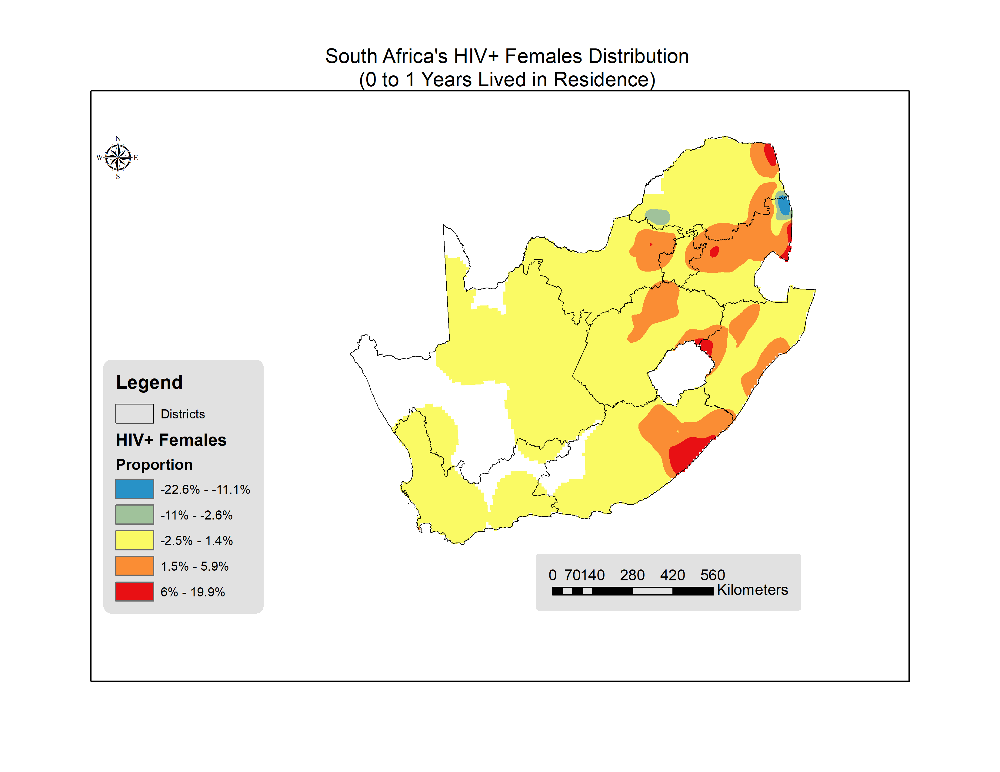
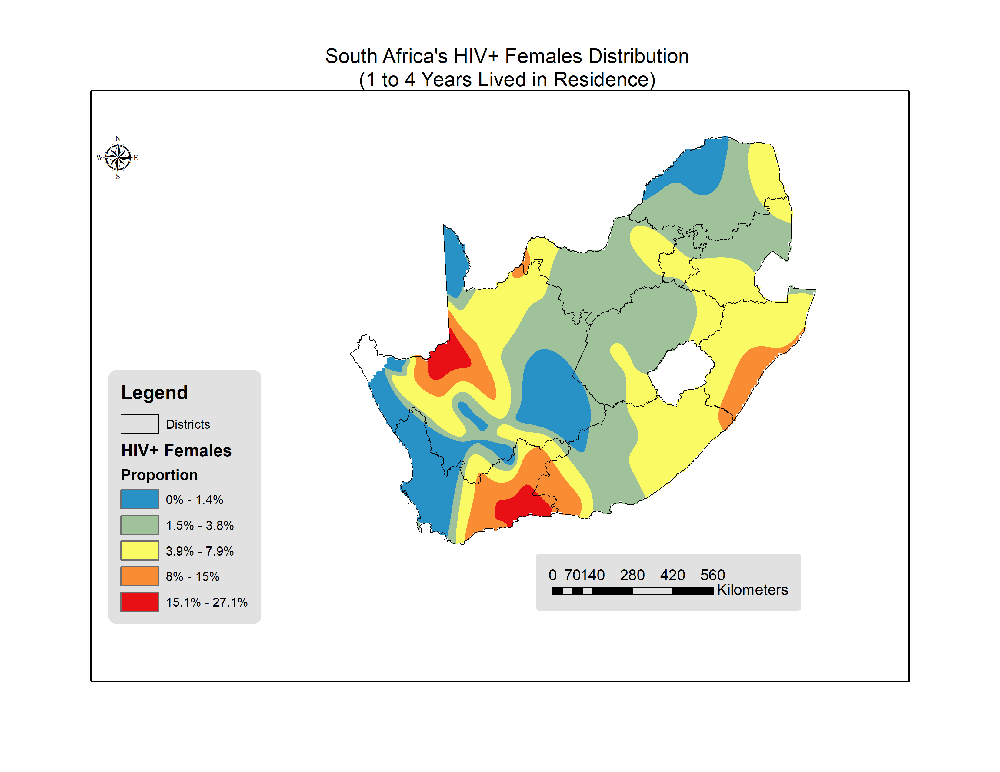
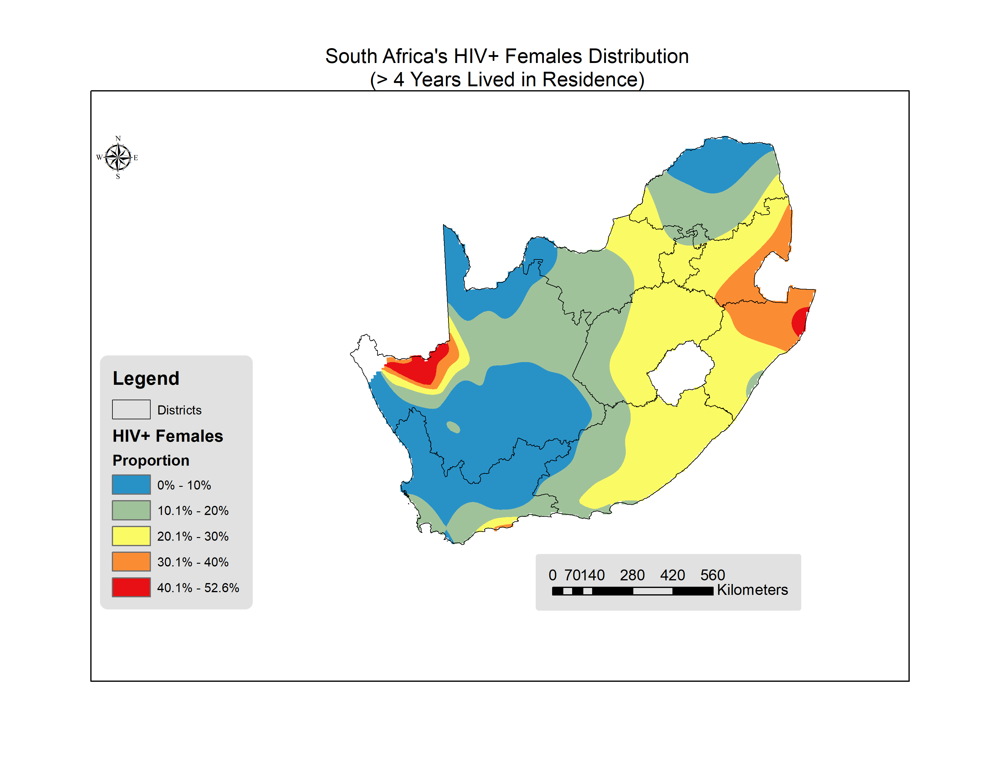
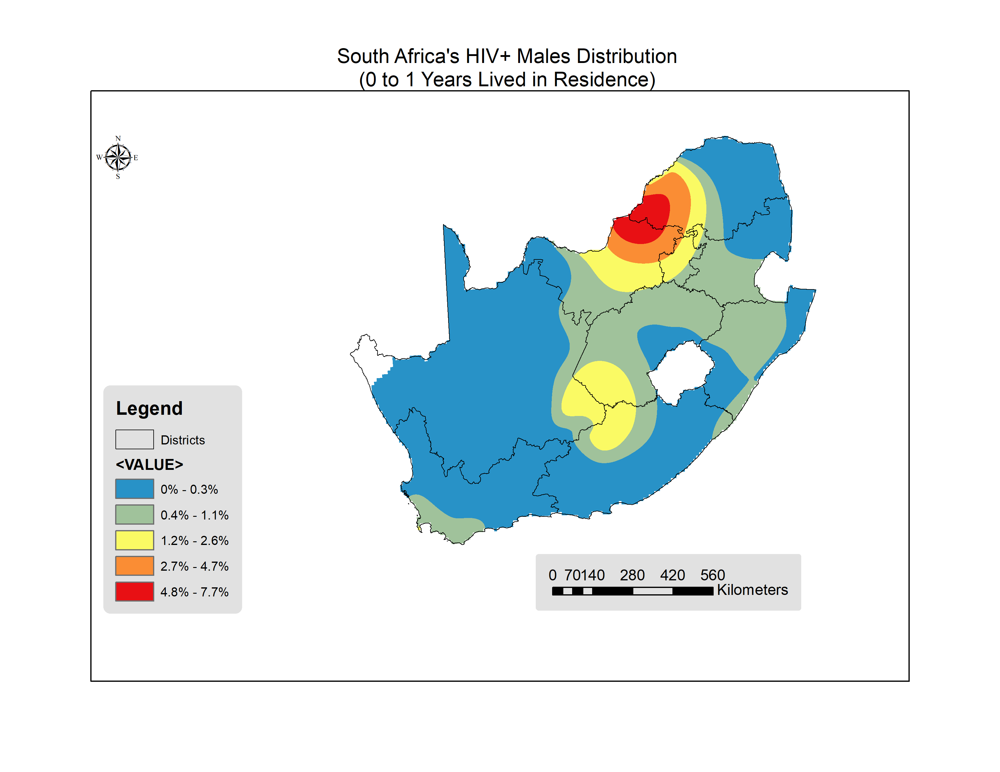
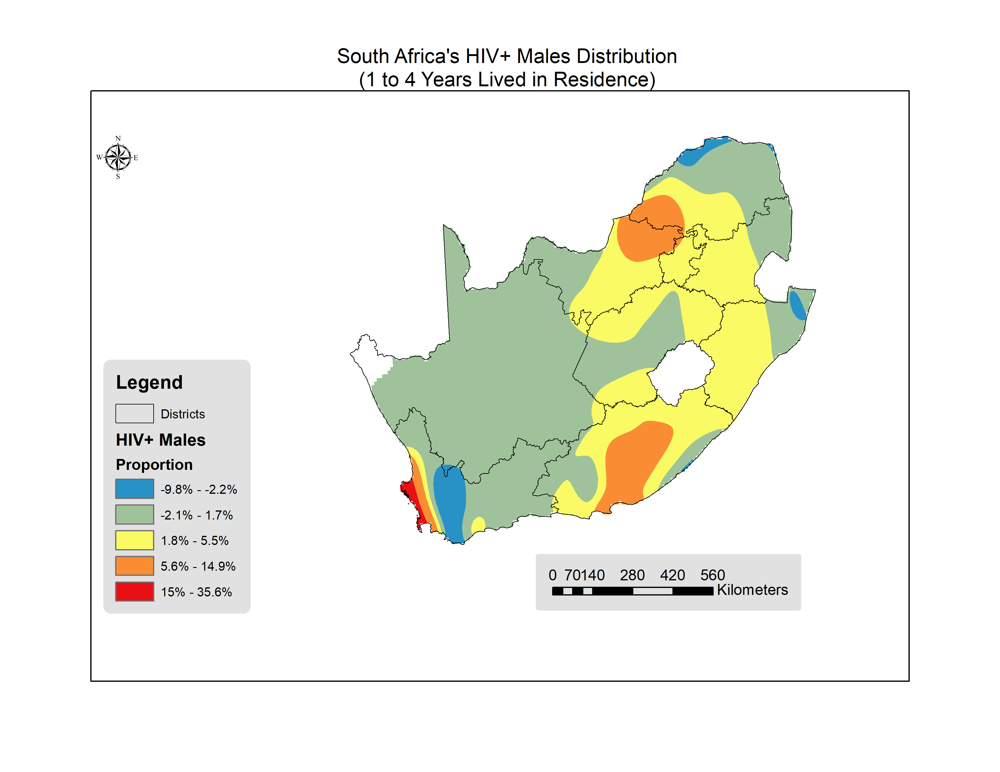
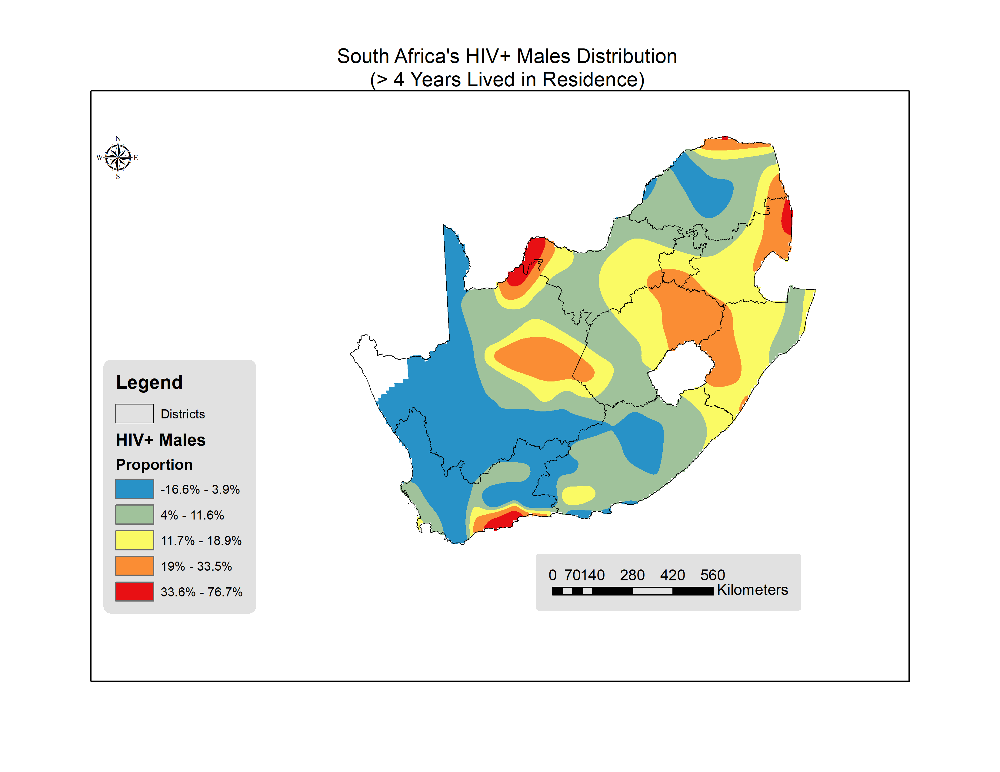

# South Africa {#week2}

## Females

```{r setup, include=FALSE, echo=FALSE, warning=FALSE,comment=FALSE}
knitr::opts_chunk$set(echo=FALSE, warning=FALSE,comment="")
rm(list = ls())
library(foreign)
library(plyr)
library(survey)
# library(finalfit)
library(jtools)
library(kableExtra)
library(broom)
library(ggstance)
# load female, male and hiv records of Zimbabwe
# femaleDataFrame <- read.csv("../2019/stata_version/females.csv",header = T)
femaleDataFrame <- read.dta("../SouthAfrica/2019/Individual_Recode_SA/ZAIR71FL.DTA")
hivDataFrame <- read.csv("../SouthAfrica/2019/stata_version/hiv.csv",header = T)
```


```{r}
# Extract variables of interest
femaleDataset <- as.data.frame(femaleDataFrame$v001) #clnumber
femaleDataset$V002 <- femaleDataFrame$v002 # hhnumber
femaleDataset$V003 <- femaleDataFrame$v003 # linenumber
femaleDataset$V005 <- femaleDataFrame$v005 # indivweight
femaleDataset$V013 <- femaleDataFrame$v013 # agegroup
femaleDataset$V104 <- femaleDataFrame$v104 # YLivedinResidence
femaleDataset$V190 <- femaleDataFrame$v190 # Wealthindexcombined
femaleDataset$V106 <- femaleDataFrame$v106 # higher level of education
femaleDataset$V130 <- femaleDataFrame$v130 # religion
femaleDataset$V481 <- femaleDataFrame$v481 # covered by health insurance
femaleDataset$V501 <- femaleDataFrame$v501 # marital status
femaleDataset$sex <- "f"

#sexual variables
femaleDataset$V781 <- femaleDataFrame$v781 # hivtested
femaleDataset$V763a <- femaleDataFrame$v763a # previous STI 12 
femaleDataset$V766b <- femaleDataFrame$v766b # number of sex partners
femaleDataset$V754dp <- femaleDataFrame$v754dp # risk one partner

femaleDataset$V754cp <- femaleDataFrame$v754cp # risk one partner
femaleDataset$V791a <- femaleDataFrame$v791a# Last 12 months had sex in return for gifts, 
#geographical variables
femaleDataset$region <- femaleDataFrame$v024 # region
femaleDataset$placeType <- femaleDataFrame$v025 # rural or urban
femaleDataset$V026 <- femaleDataFrame$v026 # placeLocation
femaleDataset$PSU <- femaleDataFrame$v021 # PSU svydesign
femaleDataset$V022 <- femaleDataFrame$v022 # Strata sampling error

# rename each column for nemonic purposes
names(femaleDataset) <- c(
  "clnumber",
  "hhnumber",
  "linenumber",
  "indivweight",
  "agegroup",
  "YLivedinResidence",
  "Wealthindexcombined",
  "education",
  "religion",
  "healthInsured",
  "maritalStatus",
  "sex",
  
  "hivtested",
  "previousSTI",
  "sexPartners",
  "have1sexpartner",
  
  "alwaysCondom",
  "paidforsex",
  
  "region",
  "placeType",
  "placeLocation",
  "PSU",
  "V022"
)

# summary(femaleDataset)
# id for females
femaleDataset$id<-paste(femaleDataset$clnumber,
                        femaleDataset$hhnumber,
                        femaleDataset$linenumber,sep="")
femaleDataset$id<-as.numeric(femaleDataset$id, 16L)
```


```{r}

# Extract variables from HIV
hivdataset <- as.data.frame(hivDataFrame$HIVCLUST) #clnumber
hivdataset$HIVNUMB <- hivDataFrame$HIVNUMB # hhnumber
hivdataset$HIVLINE <- hivDataFrame$HIVLINE # linenumber
hivdataset$HIV03 <- hivDataFrame$HIV03 # BloodTest
hivdataset$HIV05 <- hivDataFrame$HIV05 # sample weight
names(hivdataset) <- c(
  "clnumber",
  "hhnumber",
  "linenumber",
  "hivStatus",
  "sampleweight"
)
# key for join creation
hivdataset$id<-paste(hivdataset$clnumber,
                     hivdataset$hhnumber,
                     hivdataset$linenumber,sep="")
hivdataset$id<-as.numeric(hivdataset$id, 16L)
```


```{r}
################## Cleaning
### merge female and hiv
merged.data <- merge(femaleDataset, hivdataset, by = "id")
# agegroup
#table(merged.data$agegroup)


# migration status
 # table(merged.data$YLivedinResidence)
merged.data<- subset(merged.data, YLivedinResidence<=95 )  # se remueven visitantes, missing, dont know

merged.data$migstatus<-"gt4"
merged.data$migstatus[merged.data$YLivedinResidence == 0] <-"0_1y"
merged.data$migstatus[merged.data$YLivedinResidence == 1 | 
                        merged.data$YLivedinResidence ==2|
                         merged.data$YLivedinResidence == 3 | 
                        merged.data$YLivedinResidence ==4] <-"1_4y"

# table(merged.data$migstatus)
merged.data$migstatus<-as.factor(merged.data$migstatus)

#hivStatus
# table(merged.data$hivStatus)
merged.data <-merged.data[merged.data$hivStatus == "0" | merged.data$hivStatus == "1", ]
merged.data$hivStatus<-as.factor(revalue(as.character(merged.data$hivStatus), c("0" = "hiv-","1"="hiv+")))

# normalize weight
merged.data$indivweight<-merged.data$indivweight/1000000
#check NAs
merged.data<-merged.data[!is.na(merged.data$indivweight),]


#Wealthindexcombined
# table(merged.data$Wealthindexcombined)


# education
 # table(merged.data$education)


# marital status
 # table(merged.data$maritalStatus)
# merged.data$maritalStatus<-as.factor(revalue(as.character(merged.data$maritalStatus),
#                                                c("0" = "Never in union",
#                                                  "1"="Married",
#                                                  "2"="Living with partner",
#                                                  "3"="Widowed",
#                                                  "4"="Divorced",
#                                                  "5"="No longer living together/separated"
#                                                  )))

# religion
 # summary(merged.data$religion) # all NAs, nothing to do

# healthInsured
 # table(merged.data$healthInsured)
 # summary(merged.data$healthInsured)
merged.data<-merged.data[!is.na(merged.data$healthInsured),]

## have1sexpartner
# summary(merged.data$have1sexpartner) # all NAs,  nothing to do

# sexPartners
# table(merged.data$sexPartners)
merged.data <-merged.data[merged.data$sexPartners != 99, ]
merged.data$poligamy<-"Yes"
merged.data$poligamy[merged.data$sexPartners == 0 | merged.data$sexPartners == 1]<-"No"
merged.data$poligamy<-as.factor(merged.data$poligamy)
# table(merged.data$migstatus,merged.data$poligamy)

# paid for sex
# summary(merged.data$paidforsex) # 2200 NAs, 

# always condom 
# summary(merged.data$alwaysCondom) # all NAs, nothing to do

# previousSTI
 # table(merged.data$previousSTI)
merged.data <-merged.data[merged.data$previousSTI == "no" | merged.data$previousSTI == "yes", ]
merged.data$previousSTI<-as.factor(merged.data$previousSTI)
```


```{r}
merged.data$migstatus<-relevel(merged.data$migstatus, ref = "gt4")

# merged.data$placeType<-relevel(merged.data$placeType, ref = "Rural")
merged.data$hivStatus<-relevel(merged.data$hivStatus, ref = "hiv-")
# merged.data$agegroup<-relevel(merged.data$agegroup, ref = "15-19")
# merged.data$Wealthindexcombined<-relevel(merged.data$Wealthindexcombined, ref = "Poorest")


options (survey.lonely.psu = "remove")
dhs1<- svydesign(id = ~PSU, 
                 strata = ~V022,
                 weights = ~indivweight,
                 nest=TRUE,
                 data = merged.data)

 # summary(dhs1)
```

<!-- ## Collinearity -->

```{r,eval=FALSE}

#multicolinealidad
svychisq(~migstatus+hivStatus, design = dhs1)

tab<-svytable(~migstatus+hivStatus, design = dhs1)
# tab<-table(merged.data$bloodtest,merged.data$migstatus)
# tab
barplot(tab,beside = T,legend=T)
chisq.test(tab)
fisher.test(tab,
            conf.int = T,
            conf.level = 0.95)

# aqui descarto poligamia porque ambas son colineales
# svychisq(~have1sexpartner+poligamy, design = dhs1, statistic="Wald")

```

<!-- Based on the proportion test, we can argue there is not significative evidence that proportions in _HIV+ females_ varies between _migrant_ and _non migrant_. -->


### HIV Analysis

```{r,fig.cap="Visual representation of CI for hiv model."}
# table(merged.data$religion) # no se incluye porque solo 534 tienen respuesta
fit<-svyglm(hivStatus~agegroup+
              education+
              healthInsured+
              maritalStatus+
              Wealthindexcombined+
              migstatus+
              placeType+
              previousSTI+
              hivtested,
            data=merged.data,
            family=quasibinomial(),
            design=dhs1)
# summary(fit)  ##right

# exp(confint(fit))
# fit$aic
# fit$deviance
# fit$R

summ(fit, exp = T,confint = TRUE,digits = 3)

```

### Migration Analysis

#### Migration 0-1 ~ cofactors for females

```{r}
 # table(merged.data$migstatus)
only0_1y<-merged.data

only0_1y$migstatus<-as.factor(revalue(as.character(only0_1y$migstatus), 
                                      c("gt4" = "gt1","1_4y"="gt1")))
 # table(only0_1y$migstatus)
only0_1y$migstatus<-relevel(only0_1y$migstatus,ref="gt1")

dhs2<- svydesign(id = ~PSU, 
                 strata = ~V022,
                 weights = ~indivweight,
                 nest=TRUE,
                 data = only0_1y)

fit2<-svyglm(migstatus~agegroup+
              education+
              healthInsured+
              maritalStatus+
              Wealthindexcombined+
              placeType+
              previousSTI+
              hivtested,
            data=only0_1y,
            family=quasibinomial(),
            design=dhs2)
# summary(fit2)
summ(fit2, exp = T,confint = TRUE,digits = 3)

```

#### Migration 1-5 ~ cofactors for males

```{r}
# table(merged.data$migstatus)
only1_4y<-merged.data

only1_4y$migstatus<-as.factor(revalue(as.character(only1_4y$migstatus), 
                                      c("gt4" = "others","0_1y"="others")))
# table(only1_4y$migstatus)
only1_4y$migstatus<-relevel(only1_4y$migstatus,ref="others")

dhs3<- svydesign(id = ~PSU, 
                 strata = ~V022,
                 weights = ~indivweight,
                 nest=TRUE,
                 data = only1_4y)

fit3<-svyglm(migstatus~agegroup+
              education+
              healthInsured+
              maritalStatus+
              Wealthindexcombined+
              placeType+
              previousSTI+
              hivtested,
            data=only0_1y,
            family=quasibinomial(),
            design=dhs3)
# summary(fit3)
summ(fit3, exp = T,confint = TRUE,digits = 3)
```

### Mapping

```{r, eval=FALSE}
# 0_1y
table(merged.data$hivStatus,merged.data$migstatus)
merged.data$m0_1y.hiv<-0
merged.data$m0_1y.hiv[merged.data$migstatus=="0_1y" & merged.data$hivStatus=="hiv+"]<-1*merged.data$indivweight[merged.data$migstatus=="0_1y" & merged.data$hivStatus=="hiv+"]

merged.data$m0_1y.nonhiv<-0
merged.data$m0_1y.nonhiv[merged.data$migstatus=="0_1y" & merged.data$hivStatus=="hiv-"]<-1*merged.data$indivweight[merged.data$migstatus=="0_1y" & merged.data$hivStatus=="hiv-"]

# 1_4y
merged.data$m1_4y.hiv<-0
merged.data$m1_4y.hiv[merged.data$migstatus=="1_4y" & merged.data$hivStatus=="hiv+"]<-1*merged.data$indivweight[merged.data$migstatus=="1_4y" & merged.data$hivStatus=="hiv+"]

merged.data$m1_4y.nonhiv<-0
merged.data$m1_4y.nonhiv[merged.data$migstatus=="1_4y" & merged.data$hivStatus=="hiv-"]<-1*merged.data$indivweight[merged.data$migstatus=="1_4y" & merged.data$hivStatus=="hiv-"]

# gt4
merged.data$gt4.hiv<-0
merged.data$gt4.hiv[merged.data$migstatus=="gt4" & merged.data$hivStatus=="hiv+"]<-1*merged.data$indivweight[merged.data$migstatus=="gt4" & merged.data$hivStatus=="hiv+"]

merged.data$gt4.nonhiv<-0
merged.data$gt4.nonhiv[merged.data$migstatus=="gt4" & merged.data$hivStatus=="hiv-"]<-1*merged.data$indivweight[merged.data$migstatus=="gt4" & merged.data$hivStatus=="hiv-"]


# agregacion por cluster
fileexport <- as.data.frame.matrix(
  aggregate(cbind(
    merged.data$m0_1y.hiv,
    merged.data$m0_1y.nonhiv,
    merged.data$m1_4y.hiv,
    merged.data$m1_4y.nonhiv,
    merged.data$gt4.hiv,
    merged.data$gt4.nonhiv,
    merged.data$indivweight) ~ merged.data$PSU,
    FUN = sum, data = merged.data))
names(fileexport) <- c(
  "clnumber",
  "m0_1y.hiv",
  "m0_1y.nonhiv",
  "m1_4y.hiv",
  "m1_4y.nonhiv",
  "gt4.hiv",
  "gt4.nonhiv",
  "total.pop"
)

# 0_1y
fileexport$m0_1y.hiv.rate<-fileexport$m0_1y.hiv/fileexport$total.pop # hiv migrants distribution
fileexport$allm0_1y.rate<-(fileexport$m0_1y.hiv+fileexport$m0_1y.nonhiv)/fileexport$total.pop #all migrants distribution
# 1_4y
fileexport$m1_4y.hiv.rate<-fileexport$m1_4y.hiv/fileexport$total.pop 
fileexport$allm1_4y.rate<-(fileexport$m1_4y.hiv+fileexport$m1_4y.nonhiv)/fileexport$total.pop #all migrants distribution
# gt4
fileexport$gt4.hiv.rate<-(fileexport$gt4.hiv)/fileexport$total.pop

#all
fileexport$allhiv.rate<-(fileexport$m0_1y.hiv+fileexport$m1_4y.hiv+fileexport$gt4.hiv)/fileexport$total.pop #hiv distribution

write.csv(fileexport, "females.spatial.csv")
```

```{r fm0_1y, echo=FALSE, fig.cap="0 to 1 Years distribution", out.width = '100%'}

```

```{r fm1_4y, echo=FALSE, fig.cap="1 to 4 Years distribution", out.width = '100%'}

```

```{r fgt4, echo=FALSE, fig.cap="Greater than 4 Years distribution", out.width = '100%'}

```


## Males


```{r}
rm(list = ls())

mDataFrame <- read.dta("../SouthAfrica/2019/ZAMR71DT/ZAMR71FL.DTA")
hivDataFrame <- read.csv("../SouthAfrica/2019/stata_version/hiv.csv",header = T)
```


```{r}
# Extract variables of interest
maleDataset <- as.data.frame(mDataFrame$mv001) #clnumber
maleDataset$MV002 <- mDataFrame$mv002 # hhnumber
maleDataset$MV003 <- mDataFrame$mv003 # linenumber
maleDataset$MV005 <- mDataFrame$mv005 # indivweight
maleDataset$MV013 <- mDataFrame$mv013 # agegroup
maleDataset$MV104 <- mDataFrame$mv104 # YLivedinResidence
maleDataset$MV190 <- mDataFrame$mv190 # Wealthindexcombined
maleDataset$MV106 <- mDataFrame$mv106 # higher level of education
maleDataset$MV130 <- mDataFrame$mv130 # religion
maleDataset$MV481 <- mDataFrame$mv481 # covered by health insurance
maleDataset$MV501 <- mDataFrame$mv501 # marital status
maleDataset$sex <- "m"

#sexual variables
maleDataset$MV781 <- mDataFrame$mv781 # hivtested
maleDataset$MV763a <- mDataFrame$mv763a # previous STI 12
maleDataset$MV766b <- mDataFrame$mv766b # number of sex partners
maleDataset$MV754dp <- mDataFrame$mv754dp # risk one partner

maleDataset$MV754cp <- mDataFrame$mv754cp # risk one partner
maleDataset$MV793 <- mDataFrame$mv793# Last 12 months had sex in return for gifts,
#geographical variables
maleDataset$region <- mDataFrame$mv024 # region
maleDataset$placeType <- mDataFrame$mv025 # rural or urban
maleDataset$V026 <- mDataFrame$mv026 # placeLocation
maleDataset$PSU <- mDataFrame$mv021 # PSU svydesign
maleDataset$MV022 <- mDataFrame$mv022 # Strata sampling error

# rename each column for nemonic purposes
names(maleDataset) <- c(
  "clnumber",
  "hhnumber",
  "linenumber",
  "indivweight",
  "agegroup",
  "YLivedinResidence",
  "Wealthindexcombined",
  "education",
  "religion",
  "healthInsured",
  "maritalStatus",
  "sex",

  "hivtested",
  "previousSTI",
  "sexPartners",
  "have1sexpartner",

  "alwaysCondom",
  "paidforsex",

  "region",
  "placeType",
  "placeLocation",
  "PSU",
  "V022"
)

# summary(maleDataset)
# id for females
maleDataset$id<-paste(maleDataset$clnumber,
                        maleDataset$hhnumber,
                        maleDataset$linenumber,sep="")
maleDataset$id<-as.numeric(maleDataset$id, 16L)
```


```{r}

# Extract variables from HIV
hivdataset <- as.data.frame(hivDataFrame$HIVCLUST) #clnumber
hivdataset$HIVNUMB <- hivDataFrame$HIVNUMB # hhnumber
hivdataset$HIVLINE <- hivDataFrame$HIVLINE # linenumber
hivdataset$HIV03 <- hivDataFrame$HIV03 # BloodTest
hivdataset$HIV05 <- hivDataFrame$HIV05 # sample weight
names(hivdataset) <- c(
  "clnumber",
  "hhnumber",
  "linenumber",
  "hivStatus",
  "sampleweight"
)
# key for join creation
hivdataset$id<-paste(hivdataset$clnumber,
                     hivdataset$hhnumber,
                     hivdataset$linenumber,sep="")
hivdataset$id<-as.numeric(hivdataset$id, 16L)
```


```{r}
################## Cleaning
### merge female and hiv
merged.data <- merge(maleDataset, hivdataset, by = "id")
# agegroup
# table(merged.data$agegroup)


# migration status
  # table(merged.data$YLivedinResidence)
merged.data<- subset(merged.data, YLivedinResidence<=95 )  # se remueven visitantes, missing, dont know

merged.data$migstatus<-"gt4"
merged.data$migstatus[merged.data$YLivedinResidence == 0] <-"0_1y"
merged.data$migstatus[merged.data$YLivedinResidence == 1 |
                        merged.data$YLivedinResidence ==2|
                         merged.data$YLivedinResidence == 3 |
                        merged.data$YLivedinResidence ==4] <-"1_4y"

 # table(merged.data$migstatus)
merged.data$migstatus<-as.factor(merged.data$migstatus)

#hivStatus
 table(merged.data$hivStatus)
merged.data <-merged.data[merged.data$hivStatus == "0" | merged.data$hivStatus == "1", ]
merged.data$hivStatus<-as.factor(revalue(as.character(merged.data$hivStatus), c("0" = "hiv-","1"="hiv+")))

# normalize weight
merged.data$indivweight<-merged.data$indivweight/1000000
#check NAs
merged.data<-merged.data[!is.na(merged.data$indivweight),]


#Wealthindexcombined
 # table(merged.data$Wealthindexcombined)


# education
  # table(merged.data$education)


# marital status
  # table(merged.data$maritalStatus)
# merged.data$maritalStatus<-as.factor(revalue(as.character(merged.data$maritalStatus),
#                                                c("0" = "Never in union",
#                                                  "1"="Married",
#                                                  "2"="Living with partner",
#                                                  "3"="Widowed",
#                                                  "4"="Divorced",
#                                                  "5"="No longer living together/separated"
#                                                  )))

# religion
 # summary(merged.data$religion) # all NAs, nothing to do

# healthInsured
 # table(merged.data$healthInsured)
 # summary(merged.data$healthInsured)
merged.data<-merged.data[!is.na(merged.data$healthInsured),]

## have1sexpartner
 # summary(merged.data$have1sexpartner) # all NAs,  nothing to do

# sexPartners
# table(merged.data$sexPartners)
merged.data <-merged.data[merged.data$sexPartners != 99, ]
merged.data$poligamy<-"Yes"
merged.data$poligamy[merged.data$sexPartners == 0 | merged.data$sexPartners == 1]<-"No"
merged.data$poligamy<-as.factor(merged.data$poligamy)
 # table(merged.data$migstatus,merged.data$poligamy)

# paid for sex
 # summary(merged.data$paidforsex)

# always condom
 # summary(merged.data$alwaysCondom) # all NAs, nothing to do

# previousSTI
 table(merged.data$previousSTI)
merged.data <-merged.data[merged.data$previousSTI == "no" | merged.data$previousSTI == "yes", ]
merged.data$previousSTI<-as.factor(merged.data$previousSTI)
```


```{r}
merged.data$migstatus<-relevel(merged.data$migstatus, ref = "gt4")

# merged.data$placeType<-relevel(merged.data$placeType, ref = "Rural")
merged.data$hivStatus<-relevel(merged.data$hivStatus, ref = "hiv-")
# merged.data$agegroup<-relevel(merged.data$agegroup, ref = "15-19")
# merged.data$Wealthindexcombined<-relevel(merged.data$Wealthindexcombined, ref = "Poorest")


options (survey.lonely.psu = "remove")
dhs1<- svydesign(id = ~PSU,
                 strata = ~V022,
                 weights = ~indivweight,
                 nest=TRUE,
                 data = merged.data)

  # summary(dhs1)
```


<!-- ## Collinearity -->

```{r,eval=FALSE}

#multicolinealidad
svychisq(~migstatus+hivStatus, design = dhs1)

tab<-svytable(~migstatus+hivStatus, design = dhs1)
# tab<-table(merged.data$bloodtest,merged.data$migstatus)
# tab
barplot(tab,beside = T,legend=T)
chisq.test(tab)
fisher.test(tab,
            conf.int = T,
            conf.level = 0.95)

# aqui descarto poligamia porque ambas son colineales
# svychisq(~have1sexpartner+poligamy, design = dhs1, statistic="Wald")

```

<!-- Based on the proportion test, we can argue there is not significative evidence that proportions in _HIV+ females_ varies between _migrant_ and _non migrant_. -->

### HIV Analysis

```{r,fig.cap="Visual representation of CI for hiv model."}
# table(merged.data$religion) # no se incluye porque solo 534 tienen respuesta
fit<-svyglm(hivStatus~agegroup+
              education+
              healthInsured+
              maritalStatus+
              Wealthindexcombined+
              migstatus+
              placeType+
              previousSTI+
              hivtested,
            data=merged.data,
            family=quasibinomial(),
            design=dhs1)
# summary(fit)  ##right

# exp(confint(fit))
# fit$aic
# fit$deviance
# fit$R

summ(fit, exp = T,confint = TRUE,digits = 3)

```

### Migration Analysis

#### Migration 0-1 ~ cofactors for females

```{r}
 # table(merged.data$migstatus)
only0_1y<-merged.data

only0_1y$migstatus<-as.factor(revalue(as.character(only0_1y$migstatus),
                                      c("gt4" = "gt1","1_4y"="gt1")))
 # table(only0_1y$migstatus)
only0_1y$migstatus<-relevel(only0_1y$migstatus,ref="gt1")

dhs2<- svydesign(id = ~PSU,
                 strata = ~V022,
                 weights = ~indivweight,
                 nest=TRUE,
                 data = only0_1y)

fit2<-svyglm(migstatus~agegroup+
              education+
              healthInsured+
              maritalStatus+
              Wealthindexcombined+
              placeType+
              previousSTI+
              hivtested,
            data=only0_1y,
            family=quasibinomial(),
            design=dhs2)
# summary(fit2)
summ(fit2, exp = T,confint = TRUE,digits = 3)

```

#### Migration 1-5 ~ cofactors for males

```{r}
# table(merged.data$migstatus)
only1_4y<-merged.data

only1_4y$migstatus<-as.factor(revalue(as.character(only1_4y$migstatus),
                                      c("gt4" = "others","0_1y"="others")))
# table(only1_4y$migstatus)
only1_4y$migstatus<-relevel(only1_4y$migstatus,ref="others")

dhs3<- svydesign(id = ~PSU,
                 strata = ~V022,
                 weights = ~indivweight,
                 nest=TRUE,
                 data = only1_4y)

fit3<-svyglm(migstatus~agegroup+
              education+
              healthInsured+
              maritalStatus+
              Wealthindexcombined+
              placeType+
              previousSTI+
              hivtested,
            data=only0_1y,
            family=quasibinomial(),
            design=dhs3)
# summary(fit3)
summ(fit3, exp = T,confint = TRUE,digits = 3)
```

### Mapping

```{r, eval=FALSE}
# 0_1y
table(merged.data$hivStatus,merged.data$migstatus)
merged.data$m0_1y.hiv<-0
merged.data$m0_1y.hiv[merged.data$migstatus=="0_1y" & merged.data$hivStatus=="hiv+"]<-1*merged.data$indivweight[merged.data$migstatus=="0_1y" & merged.data$hivStatus=="hiv+"]

merged.data$m0_1y.nonhiv<-0
merged.data$m0_1y.nonhiv[merged.data$migstatus=="0_1y" & merged.data$hivStatus=="hiv-"]<-1*merged.data$indivweight[merged.data$migstatus=="0_1y" & merged.data$hivStatus=="hiv-"]

# 1_4y
merged.data$m1_4y.hiv<-0
merged.data$m1_4y.hiv[merged.data$migstatus=="1_4y" & merged.data$hivStatus=="hiv+"]<-1*merged.data$indivweight[merged.data$migstatus=="1_4y" & merged.data$hivStatus=="hiv+"]

merged.data$m1_4y.nonhiv<-0
merged.data$m1_4y.nonhiv[merged.data$migstatus=="1_4y" & merged.data$hivStatus=="hiv-"]<-1*merged.data$indivweight[merged.data$migstatus=="1_4y" & merged.data$hivStatus=="hiv-"]

# gt4
merged.data$gt4.hiv<-0
merged.data$gt4.hiv[merged.data$migstatus=="gt4" & merged.data$hivStatus=="hiv+"]<-1*merged.data$indivweight[merged.data$migstatus=="gt4" & merged.data$hivStatus=="hiv+"]

merged.data$gt4.nonhiv<-0
merged.data$gt4.nonhiv[merged.data$migstatus=="gt4" & merged.data$hivStatus=="hiv-"]<-1*merged.data$indivweight[merged.data$migstatus=="gt4" & merged.data$hivStatus=="hiv-"]


# agregacion por cluster
fileexport <- as.data.frame.matrix(
  aggregate(cbind(
    merged.data$m0_1y.hiv,
    merged.data$m0_1y.nonhiv,
    merged.data$m1_4y.hiv,
    merged.data$m1_4y.nonhiv,
    merged.data$gt4.hiv,
    merged.data$gt4.nonhiv,
    merged.data$indivweight) ~ merged.data$PSU,
    FUN = sum, data = merged.data))
names(fileexport) <- c(
  "clnumber",
  "m0_1y.hiv",
  "m0_1y.nonhiv",
  "m1_4y.hiv",
  "m1_4y.nonhiv",
  "gt4.hiv",
  "gt4.nonhiv",
  "total.pop"
)

# 0_1y
fileexport$m0_1y.hiv.rate<-fileexport$m0_1y.hiv/fileexport$total.pop # hiv migrants distribution
fileexport$allm0_1y.rate<-(fileexport$m0_1y.hiv+fileexport$m0_1y.nonhiv)/fileexport$total.pop #all migrants distribution
# 1_4y
fileexport$m1_4y.hiv.rate<-fileexport$m1_4y.hiv/fileexport$total.pop
fileexport$allm1_4y.rate<-(fileexport$m1_4y.hiv+fileexport$m1_4y.nonhiv)/fileexport$total.pop #all migrants distribution
# gt4
fileexport$gt4.hiv.rate<-(fileexport$gt4.hiv)/fileexport$total.pop

#all
fileexport$allhiv.rate<-(fileexport$m0_1y.hiv+fileexport$m1_4y.hiv+fileexport$gt4.hiv)/fileexport$total.pop #hiv distribution

write.csv(fileexport, "males.spatial.csv")
```

```{r mm0_1y, echo=FALSE, fig.cap="0 to 1 Years distribution", out.width = '100%'}

```

```{r mm1_4y, echo=FALSE, fig.cap="1 to 4 Years distribution", out.width = '100%'}

```

```{r mgt4, echo=FALSE, fig.cap="Greater than 4 Years distribution", out.width = '100%'}

```

