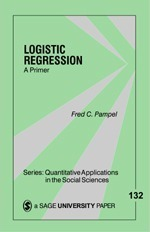

--- 
title: "Migration Paper"
bibliography: book.bib
date: "Summer 2019"
output:
  html_document:
    df_print: paged
  pdf_document: default
documentclass: book
link-citations: yes
description: Migration Paper
site: bookdown::bookdown_site
biblio-style: apalike
---

```{r,echo=FALSE}
library(knitr)
library(dplyr)
library(kableExtra)
```

# Introduction
 
## Research question {-}

We are interested in assessing if _migration status_ is associated to _hiv status_ across females and males for Zimbabwe, South Africa and Zambia. In the dataset, _migration status_ is defined as a binary variable called migstatus (0_1y=years lived in current resident < 1 year, and gt1=years lived in current resident > 1 year), and _hiv status_ is another binary variable called hivStatus (1=hiv+ and 0=hiv-). 

## Variable selection {-}

| Variables | Values | RL (ZWE)|RL (ZAF)|RL (ZMB)|
|:------------- |:-------------| -----:|-----:|-----:|
|Agegroup      | 15-19,20-24,25-29,30-34,35-39,40-44,45-49,50-54 | **15-19** |**15-19**||
|Education     | No education, Primary, Secondary, Higher |**No education** |**No education**||
|Healt insured | Yes, No | **No** |**No**||
|Marital status| Never in union, Married, Living with partner,Widowed, Divorced, separated| **Never in union**|**Never in union**||
|Wealth index combined|Poorest, Poorer, Middle, Richer, Richest|**Poorest**|**Poorest**||
|Religion|Christian, Muslim, Traditional, None/Other| **Christian**|NA**||
|Migration status|0_1 year, 1_4 years, >4 years|**gt4**|||
|placeType|Urban, Rural|**Urban**|**Urban**||
|have 1 sex partner| Yes, No| **No**|NA**||
|always use condom|Yes, No|**No**|NA**||
|previous STI|Yes, No|**No**|**No**||
|HIV tested|Yes, No|**No**|**No**||

## Textbooks {-}

```{r echo=FALSE, results='asis', warning=FALSE,fig.width=2}
b<-c('','')
nam<-c("Complex Surveys A Guide to Analysis Using R. Thomas Lumley]","Logistic Regression A Primer. Fred C. Pampel")
schedule <- data.frame(Book =b ,Name=nam)
# kable(schedule, caption = "")
kable(schedule) %>%
  kable_styling(full_width = F,position = "left") %>%
  column_spec(1, bold = T, border_right = T) %>%
  column_spec(2, width = "30em")
```

** Not included due to NA values. 